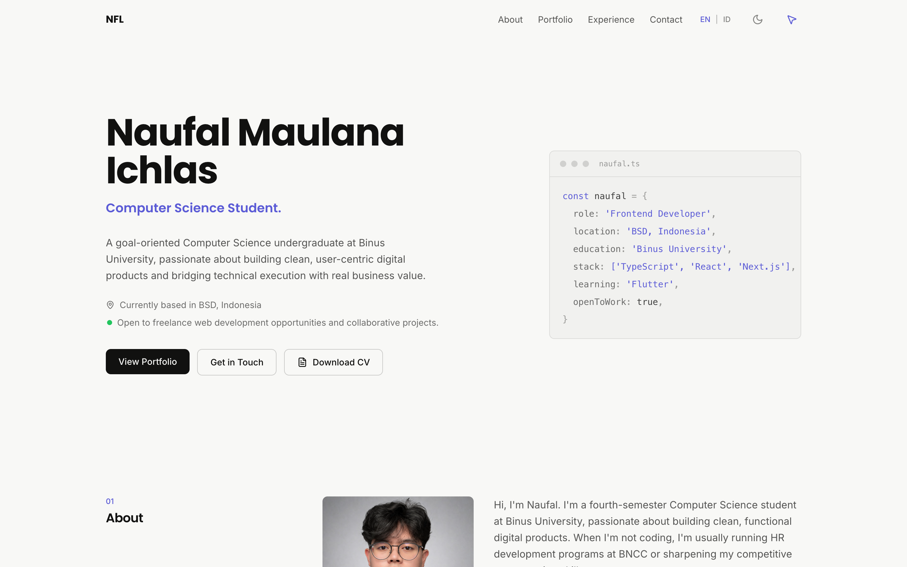
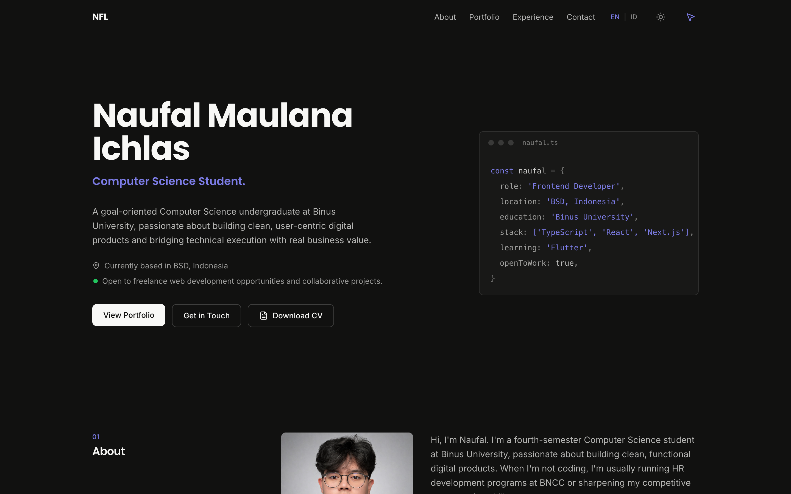
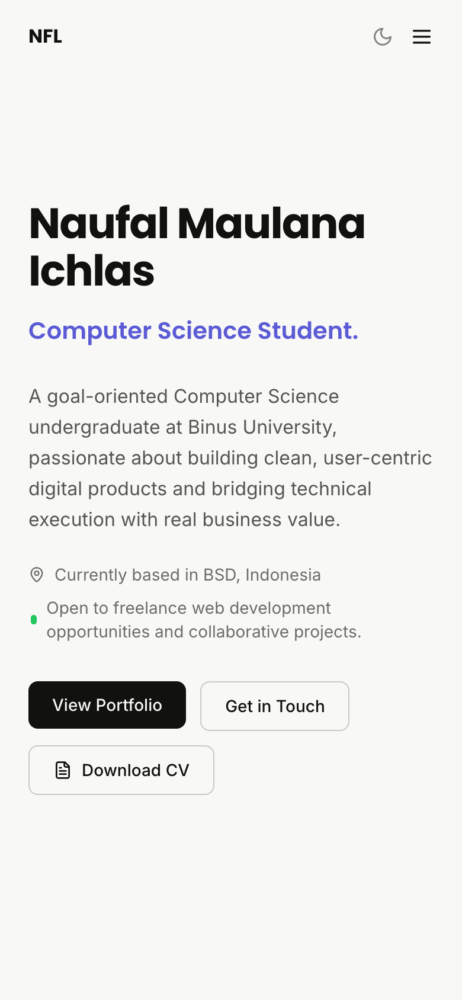

# Personal Portfolio — Naufal Maulana Ichlas

A bilingual (EN/ID) personal portfolio website with a clean, editorial design. Built as a fully static site — no server required, deployable to any shared hosting.

**Live site:** [naufalmaulana.com](https://naufalmaulana.com)



<p align="center">
  
  
</p>

## Features

- **Bilingual content** — instant English ⇄ Indonesian switching via React Context, no page reload or routing
- **Dark mode** — follows system preference on first visit, persists the user's choice, no flash on load
- **Animated hero** — cycling identity text with smooth fade/slide transitions and staggered page-load reveals
- **Custom cursor** — spring-based trailing cursor with a navbar toggle (desktop only, automatically disabled on touch devices)
- **Desktop-first details** — sticky numbered section titles, magnetic buttons, scrollspy navigation, scroll progress bar, and a `naufal.ts` code card in the hero
- **Accessible & responsive** — semantic HTML, ARIA labels, `prefers-reduced-motion` respected throughout, mobile-first layout
- **Static export** — `next build` outputs plain HTML/CSS/JS to `out/`, ready for shared hosting (Apache `.htaccess` included)

## Tech Stack

| | |
|---|---|
| Framework | [Next.js 14](https://nextjs.org/) (App Router, static export) |
| Styling | [Tailwind CSS v3](https://tailwindcss.com/) |
| Animation | [Framer Motion](https://www.framer.com/motion/) |
| Icons | [lucide-react](https://lucide.dev/) |
| Fonts | Poppins (display) + Inter (body) via `next/font` |
| Language | TypeScript |

## Getting Started

```bash
npm install
npm run dev      # development server at http://localhost:3000
npm run build    # static export to out/
```

## Project Structure

```
app/
  layout.tsx          # fonts, metadata, theme init script, providers
  page.tsx            # single-page composition of all sections
components/
  Navbar.tsx          # sticky nav, scrollspy, scroll progress, toggles
  Hero.tsx            # identity switcher, CTAs, code card
  About.tsx           # photo, reflective bio, profile chips
  Skills.tsx          # Capabilities & Toolkit — four grouped capability lists
  Portfolio.tsx       # Projects — compact cards + expandable Why/How/What case studies
  Experience.tsx      # grouped org hierarchy with expandable role details
  Volunteer.tsx       # volunteer entries
  Contact.tsx         # social links
  CustomCursor.tsx    # spring-trailing cursor (+ provider & toggle)
lib/
  i18n.ts             # ALL visible text + project/experience data in both languages
public/
  cv-naufal-maulana-ichlas.pdf   # downloadable CV (linked from the hero)
  giby-final-project.pdf         # Giby case-study PDF (opens in a new tab)
  .htaccess                      # 404 + caching rules for Apache hosting
```

## Editing Content

All text, projects, and experience entries live in **`lib/i18n.ts`** in both English and Indonesian. Add a project to both the `en` and `id` arrays and the UI renders it automatically — components contain no hardcoded copy.

## Deployment

The site is a pure static export. Build and upload the contents of `out/` to any web host (`public_html` on shared hosting). No Node.js runtime needed on the server.
